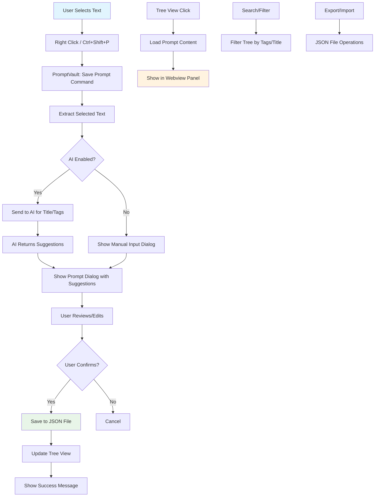

# PromptVault - VS Code Extension

A VS Code extension for locally managing and organizing AI prompts with intelligent tagging and categorization.

> **🎉 Status**: Fully implemented and ready to use! The extension provides a complete solution for saving, organizing, and reusing AI prompts within VS Code.

## ✅ What's Built

### Core Features ✅
- ✅ **Text Selection & Save**: Right-click any selected text to save as prompt
- ✅ **Tree View Organization**: Hierarchical display of prompts grouped by tags
- ✅ **Local File Storage**: JSON-based storage in `.promptvault/` directory
- ✅ **Search & Filter**: Find prompts by title, content, or tags
- ✅ **Import/Export**: Backup and share prompt collections
- ✅ **Keyboard Shortcuts**: `Ctrl+Shift+S` (Mac: `Cmd+Shift+S`) to save prompts

### AI Integration ✅
- ✅ **Smart Suggestions**: Optional OpenAI integration for title/tag generation
- ✅ **Context Awareness**: Analyzes code language and content for better suggestions
- ✅ **Fallback Mode**: Works perfectly without AI (manual input)

### User Experience ✅
- ✅ **Native VS Code Integration**: Context menus, tree views, webview panels
- ✅ **Cross-Window Support**: Works with any editor window (Copilot, Amazon Q, regular files)
- ✅ **Real-time Updates**: Tree view refreshes automatically
- ✅ **Rich Prompt Display**: Syntax highlighting and metadata

### Technical Implementation ✅
- ✅ **TypeScript**: Fully typed codebase
- ✅ **VS Code Extension API**: Native integration
- ✅ **Modular Architecture**: Separate managers for storage, AI, UI
- ✅ **Error Handling**: Graceful fallbacks and user feedback
- ✅ **Configuration**: Settings panel for customization
- ✅ **Test Suite**: Comprehensive unit tests with Mocha framework

## 📋 Feasibility Report

### ✅ Highly Feasible Features
- **Local File Storage**: Simple filesystem-based storage using JSON/text files
- **VS Code Integration**: Full access to VS Code APIs for UI, commands, and context menus
- **Text Selection & Context Menu**: Native VS Code support for selection-based actions
- **Tree View Provider**: Built-in VS Code UI component for hierarchical data display
- **Keyboard Shortcuts**: VS Code command palette and key binding support
- **AI Integration**: Can integrate with OpenAI, Anthropic, or local models for title/tag suggestions

### ⚠️ Moderate Complexity Features
- **Cross-Window Integration**: Limited direct integration with Copilot/Amazon Q windows
  - **Alternative**: Use text selection from any editor window + context menu
  - **Workaround**: Monitor active editor content and provide prompt suggestions
- **Real-time AI Processing**: Requires API keys and internet connectivity
  - **Solution**: Make AI features optional with manual fallback

### 🎯 Recommended Architecture
- **Backend**: Simple JSON file storage in user's workspace or global extension storage
- **Frontend**: VS Code Tree View + Custom Webview panels
- **AI Integration**: Optional OpenAI/Anthropic API for smart suggestions
- **Scalability Path**: Easy migration to database when needed

## 🔄 Data Flow Diagram



## 📊 Data Structure

### Prompt Object
```json
{
  "id": "uuid-v4",
  "title": "Generated Title or User Input",
  "content": "Selected prompt text",
  "tags": ["ai", "coding", "documentation"],
  "createdAt": "2025-09-20T10:30:00Z",
  "updatedAt": "2025-09-20T10:30:00Z",
  "source": "copilot|amazonq|editor",
  "language": "typescript",
  "context": "file path or context info"
}
```

### Storage Structure
```
.promptvault/
├── prompts.json          # Main prompts database
├── config.json           # Extension configuration
└── exports/              # Export directory
    └── backup-YYYY-MM-DD.json
```

## 🚀 Implementation Plan

### Phase 1: Core Features (MVP)
1. ✅ Basic extension scaffolding
2. ✅ Text selection and context menu
3. ✅ Simple prompt storage (JSON)
4. ✅ Tree view for prompt management
5. ✅ Basic CRUD operations

### Phase 2: Enhanced Features
1. 🔄 AI-powered title/tag suggestions
2. 🔄 Advanced search and filtering
3. 🔄 Import/Export functionality
4. 🔄 Keyboard shortcuts
5. 🔄 Settings panel

### Phase 3: Advanced Features
1. ⏳ Prompt templates
2. ⏳ Collaboration features
3. ⏳ Cloud sync options
4. ⏳ Analytics and usage tracking

## 🛠️ Technical Stack

- **Language**: TypeScript
- **Framework**: VS Code Extension API
- **Storage**: Local JSON files
- **UI**: VS Code Tree View + Webview API
- **AI Integration**: OpenAI API (optional)
- **Testing**: Mocha + VS Code Extension Test Runner

## 📦 Dependencies

```json
{
  "vscode": "^1.74.0",
  "@types/uuid": "^8.3.4",
  "uuid": "^8.3.2",
  "openai": "^4.0.0" // Optional for AI features
}
```

## 🎮 User Experience Flow

1. **Save Prompt**: Select text → Right-click → "Save to PromptVault" → Review AI suggestions → Save
2. **Browse Prompts**: Open PromptVault panel → Browse tree structure → Click to view
3. **Search**: Use search box to filter by title, tags, or content
4. **Organize**: Drag-drop to reorder, edit tags, create categories
5. **Export**: Backup prompts to JSON file for sharing/backup

## � Quick Start Guide

### 1. Installation
Install the extension from the VS Code marketplace or load it in development mode.

### 2. Basic Usage
1. **Select any text** in any editor (including Copilot/Amazon Q windows)
2. **Right-click** and choose "Save to PromptVault" or use `Ctrl+Shift+S` (Cmd+Shift+S on Mac)
3. **Review the suggested title and tags** (AI-powered if enabled)
4. **Save the prompt** - it will appear in the PromptVault tree view

### 3. Managing Prompts
- **View prompts**: Click on PromptVault in the Explorer panel
- **Search**: Use the search box to find specific prompts
- **Organize**: Prompts are automatically grouped by tags
- **Edit**: Right-click on any prompt to edit or delete
- **Export/Import**: Use the toolbar buttons to backup or share prompts

### 4. AI Features (Optional)
1. Get an OpenAI API key
2. Go to VS Code Settings → Extensions → PromptVault
3. Enable AI suggestions and enter your API key
4. The extension will now suggest titles and tags automatically

## �🔧 Configuration Options

- Enable/disable AI suggestions
- API key configuration
- Storage location preference
- Default tags
- Auto-save settings
- Export format preferences

## 🧪 Testing

The extension includes a comprehensive test suite covering all major functionality:

### Test Structure
- **Extension Tests**: Verify extension activation, command registration, and configuration
- **PromptManager Tests**: Test CRUD operations, search, and data persistence
- **AIService Tests**: Validate AI integration and error handling

### Running Tests
```bash
# Run all tests
pnpm run test

# Run tests in watch mode during development
pnpm run test:watch

# Run specific test files
pnpm run test -- --grep "PromptManager"
```

### Test Coverage
- ✅ Extension activation and command registration
- ✅ Prompt saving, updating, and deletion
- ✅ Search and filtering functionality
- ✅ Tag management and organization
- ✅ Error handling and edge cases
- ✅ AI service integration
- ✅ Configuration validation

All tests pass successfully and ensure the extension works reliably across different scenarios.

## 🚀 Installation & Development

### Prerequisites
- Node.js 16+ 
- pnpm (recommended package manager)
- VS Code 1.74.0+

### Setup
```bash
# Clone the repository
git clone <repo-url>
cd PromptVault

# Install dependencies
pnpm install

# Compile TypeScript
pnpm run compile

# Launch in development mode
# Press F5 in VS Code or use the "Run Extension" debug configuration
```

### Development Commands
```bash
pnpm run compile          # Compile TypeScript
pnpm run watch           # Watch mode for development
pnpm run lint            # Run ESLint
pnpm run test            # Run tests
```

### Building for Production
```bash
pnpm run vscode:prepublish
# Package with vsce
vsce package
```

## 📦 Publishing to VS Code Marketplace

### Prerequisites
1. **Microsoft Account**: Create one at [https://dev.azure.com](https://dev.azure.com)
2. **Publisher Account**: Register at [Visual Studio Marketplace](https://marketplace.visualstudio.com/manage)
3. **Personal Access Token**: Generate one in Azure DevOps

### Publishing Steps

#### 1. Install VSCE (VS Code Extension Manager)
```bash
npm install -g @vscode/vsce
```

#### 2. Create Publisher Account
- Go to [Azure DevOps](https://dev.azure.com)
- Create organization and generate Personal Access Token
- Register publisher at [VS Code Marketplace](https://marketplace.visualstudio.com/manage)

#### 3. Login to VSCE
```bash
vsce login <your-publisher-name>
# Enter your Personal Access Token when prompted
```

#### 4. Update Package.json
- Update `publisher` field to your registered publisher name
- Ensure `version`, `description`, and `repository` are correct
- Add `icon` file if you have one

#### 5. Package and Publish
```bash
# Package extension (creates .vsix file)
vsce package

# Publish to marketplace
vsce publish

# Or publish specific version
vsce publish 1.0.1
```

#### 6. Alternative: Manual Upload
- Package: `vsce package`
- Upload `.vsix` file manually at [VS Code Marketplace](https://marketplace.visualstudio.com/manage)

### Before Publishing Checklist
- [ ] Test extension thoroughly
- [ ] Update README with usage instructions
- [ ] Add proper icon (128x128 PNG)
- [ ] Set correct repository URL
- [ ] Update CHANGELOG.md
- [ ] Ensure proper licensing
- [ ] Test in clean VS Code environment

### Publishing Commands
```bash
# Package only
vsce package

# Publish new version
vsce publish patch  # 1.0.0 -> 1.0.1
vsce publish minor  # 1.0.0 -> 1.1.0  
vsce publish major  # 1.0.0 -> 2.0.0

# Publish specific version
vsce publish 1.2.3
```

---

*Ready to build! The extension will provide a seamless way to capture, organize, and reuse AI prompts locally within VS Code.*