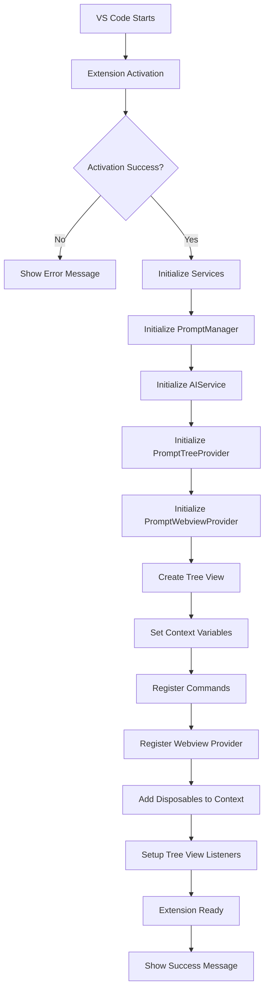
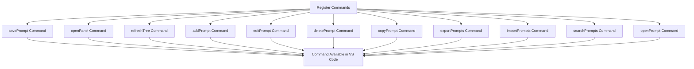
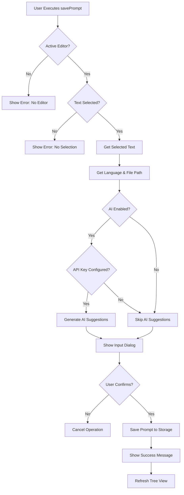
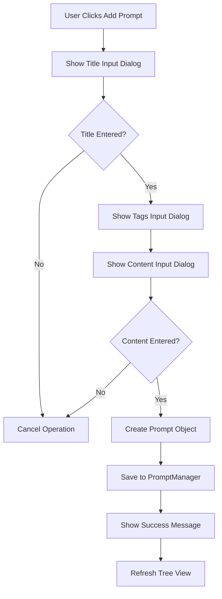
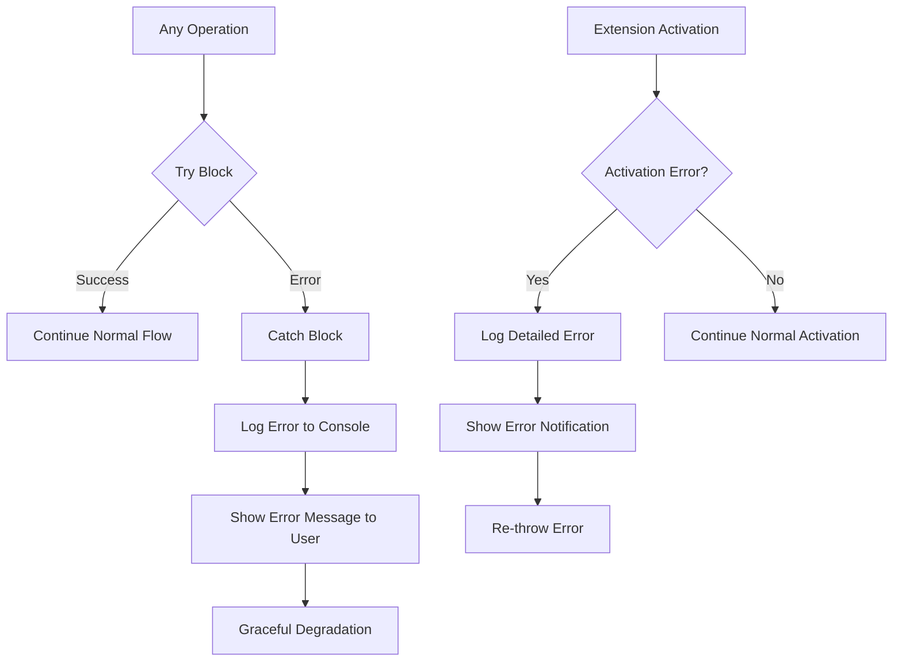
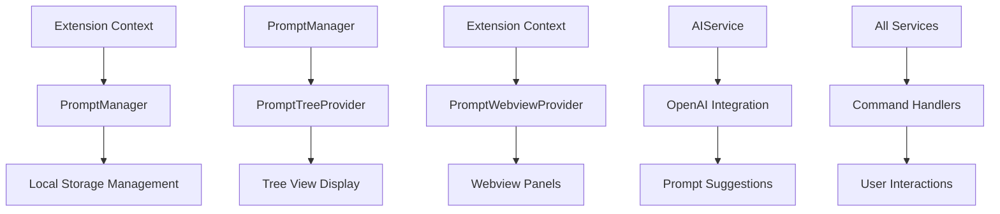
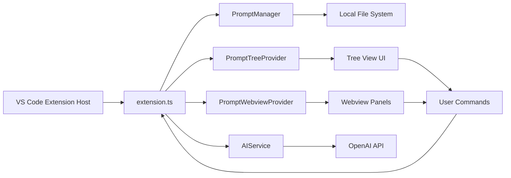
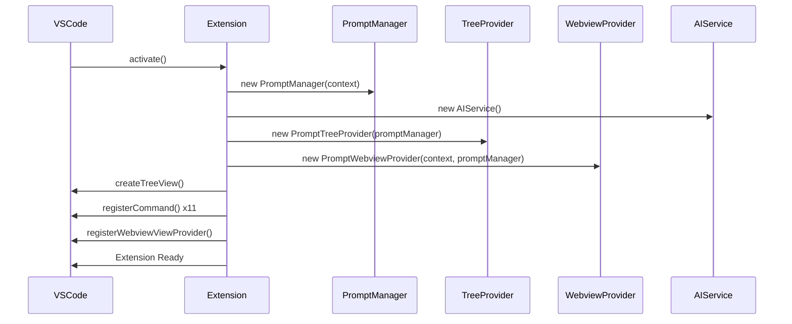

# PromptVault Extension Code Flow

## Main Extension Flow



## Command Registration Flow



## Save Selected Prompt Flow



## Add New Prompt Flow



## Tree View Interaction Flow

```mermaid
flowchart TD
    A[Tree View Loaded] --> B[PromptTreeProvider.getChildren()]
    B --> C[PromptManager.getAllPrompts()]
    C --> D[Return Prompt Items]
    
    D --> E[User Clicks Tree Item]
    E --> F{Item Type?}
    F -->|Prompt| G[Open Prompt in Panel]
    F -->|Category| H[Expand/Collapse]
    
    G --> I[Create Webview Panel]
    I --> J[Display Prompt Content]
    
    K[User Right-clicks Item] --> L[Show Context Menu]
    L --> M{Menu Action?}
    M -->|Edit| N[editPrompt Command]
    M -->|Delete| O[deletePrompt Command] 
    M -->|Copy| P[copyPrompt Command]
    
    N --> Q[Show Edit Dialog]
    O --> R[Show Confirmation Dialog]
    P --> S[Copy to Clipboard]
```

## Search Prompts Flow

```mermaid
flowchart TD
    A[User Executes Search] --> B[Show Search Input]
    B --> C{Search Term Entered?}
    C -->|No| D[Cancel Search]
    C -->|Yes| E[PromptManager.searchPrompts()]
    
    E --> F{Results Found?}
    F -->|No| G[Show No Results Message]
    F -->|Yes| H[Show Quick Pick List]
    
    H --> I{User Selects Prompt?}
    I -->|No| J[Cancel Selection]
    I -->|Yes| K[Open Selected Prompt]
    K --> L[Display in Webview Panel]
```

## Export/Import Flow

```mermaid
flowchart TD
    A[Export Command] --> B[Show Save Dialog]
    B --> C{File Path Selected?}
    C -->|No| D[Cancel Export]
    C -->|Yes| E[PromptManager.exportPrompts()]
    E --> F[Write JSON File]
    F --> G[Show Success Message]
    
    H[Import Command] --> I[Show Open Dialog]
    I --> J{File Selected?}
    J -->|No| K[Cancel Import]
    J -->|Yes| L[PromptManager.importPrompts()]
    L --> M[Read & Parse JSON]
    M --> N[Save Prompts to Storage]
    N --> O[Show Import Count]
    O --> P[Refresh Tree View]
```

## Error Handling Flow



## Service Dependencies



## Key Components Interaction



## Activation Sequence


